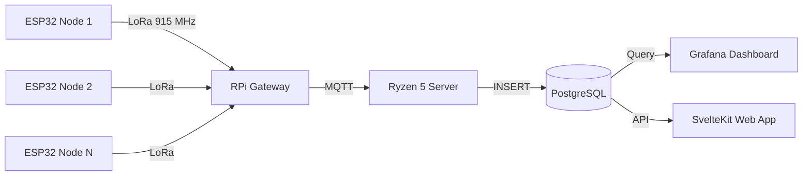

# Architecture Overview

## System Data Flow



## Component Details

### ESP32 Sensor Nodes

- **MCU:** ESP32-WROOM-32 or C3
- **Framework:** Arduino via PlatformIO
- **Power:** Solar panel + Li-Ion battery + charge controller
- **Sleep:** ESP32 deep sleep (10 µA), wakes on timer, reads sensors, transmits, sleeps
- **Radio:** E22-900T22D UART LoRa module, 915 MHz band, transparent mode at 9600 baud
- **Sensors:** BME280 (T/H/P), DS18B20 (T), rain gauge, anemometer, wind vane, soil moisture

### Raspberry Pi Gateway

- **Role:** Receives LoRa packets from all field nodes, forwards to MQTT
- **Hardware:** RPi 3B+/4/5 + LoRa HAT (single SX1276 or multi-channel SX1302 concentrator)
- **Software:** Python `lora_gateway.py` (polling-based RX → MQTT publish)
- **Location:** Near the Ryzen 5 server (no field deployment needed)

### Central Server (Ryzen 5 / Ubuntu)

- **MQTT Broker:** Mosquitto — receives raw sensor payloads
- **Ingestor:** Node.js/TypeScript service — subscribes to MQTT, inserts into PostgreSQL
- **Database:** PostgreSQL 16 — raw readings + daily aggregates + node registry
- **Visualization:** Grafana — dashboards from PostgreSQL queries
- **Future:** SvelteKit web dashboard with shadcn-svelte UI

## Radio Configuration

The E22 stores channel, air data rate and TX power in its own nonvolatile registers.
Configure both field-node and gateway radios identically before deployment. The ESP32
firmware transports payloads over UART and does not change these air settings at runtime.

| Parameter | Value | Notes |
|-----------|-------|-------|
| ESP32↔E22 UART | 9600 baud, 8N1 | Transparent serial transport |
| Normal mode | M0=LOW, M1=LOW | Send/receive weather payloads |
| Sleep mode | M0=HIGH, M1=HIGH | Entered before ESP32 deep sleep |
| AUX | HIGH = ready | Firmware waits up to 3 seconds |
| RF channel | Configure in E22 NVS | Must be in the 915 MHz band and match gateway |
| Air data rate / TX power | Configure in E22 NVS | Must match the receiving E22 module |

## Packet Format

JSON (default, for debugging):
```json
{"n":1,"t":29.4,"h":78.2,"p":1013.2,"b":3.72,"r":5,"ws":2.1,"wd":180,"sm":42}
```

Binary (compact, ~20 bytes): See `packet.h` for structure.

## Scaling

- **1-5 nodes:** Single-channel SX1276 gateway is fine
- **5-20 nodes:** Multi-channel SX1302 concentrator HAT recommended
- **20+ nodes:** ChirpStack Gateway OS + Network Server for LoRaWAN-class management

## Security

- MQTT: In production, add TLS + username/password auth
- PostgreSQL: Use strong passwords, restrict to localhost or VPN
- ESP32: No sensitive data — weather readings only, but consider LoRa encryption for integrity
