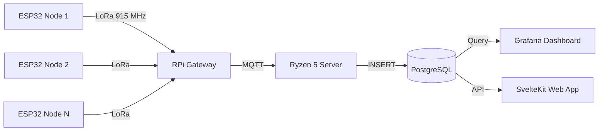

# Architecture Overview

## System Data Flow



## Component Details

### ESP32 Sensor Nodes

- **MCU:** ESP32-WROOM-32 or C3
- **Framework:** Arduino via PlatformIO
- **Power:** Solar panel + Li-Ion battery + charge controller
- **Sleep:** ESP32 deep sleep (10 µA), wakes on timer, reads sensors, transmits, sleeps
- **Radio:** SX1276/SX1278 LoRa module, 915 MHz, SF9, 125 kHz BW
- **Sensors:** BME280 (T/H/P), DS18B20 (T), rain gauge, anemometer, wind vane, soil moisture

### Raspberry Pi Gateway

- **Role:** Receives LoRa packets from all field nodes, forwards to MQTT
- **Hardware:** RPi 3B+/4/5 + LoRa HAT (single SX1276 or multi-channel SX1302 concentrator)
- **Software:** Python `lora_gateway.py` (polling-based RX → MQTT publish)
- **Location:** Near the Ryzen 5 server (no field deployment needed)

### Central Server (Ryzen 5 / Ubuntu)

- **MQTT Broker:** Mosquitto — receives raw sensor payloads
- **Ingestor:** Node.js/TypeScript service — subscribes to MQTT, inserts into PostgreSQL
- **Database:** PostgreSQL 16 — raw readings + daily aggregates + node registry
- **Visualization:** Grafana — dashboards from PostgreSQL queries
- **Future:** SvelteKit web dashboard with shadcn-svelte UI

## Radio Configuration

| Parameter | Value | Reasoning |
|-----------|-------|-----------|
| Frequency | 915.0 MHz | Philippines ISM band (ITU Region 3) |
| Bandwidth | 125 kHz | Standard LoRa BW, good balance |
| Spreading Factor | 9 | ~2-5 km range, ~72 ms air time for 50B |
| Coding Rate | 4/5 | Standard error correction |
| TX Power | 17 dBm | Max legal for SX1276 |
| Duty Cycle | ~1% | Self-imposed (PH has no strict limit) |

## Packet Format

JSON (default, for debugging):
```json
{"n":1,"t":29.4,"h":78.2,"p":1013.2,"b":3.72,"r":5,"ws":2.1,"wd":180,"sm":42}
```

Binary (compact, ~20 bytes): See `packet.h` for structure.

## Scaling

- **1-5 nodes:** Single-channel SX1276 gateway is fine
- **5-20 nodes:** Multi-channel SX1302 concentrator HAT recommended
- **20+ nodes:** ChirpStack Gateway OS + Network Server for LoRaWAN-class management

## Security

- MQTT: In production, add TLS + username/password auth
- PostgreSQL: Use strong passwords, restrict to localhost or VPN
- ESP32: No sensitive data — weather readings only, but consider LoRa encryption for integrity
